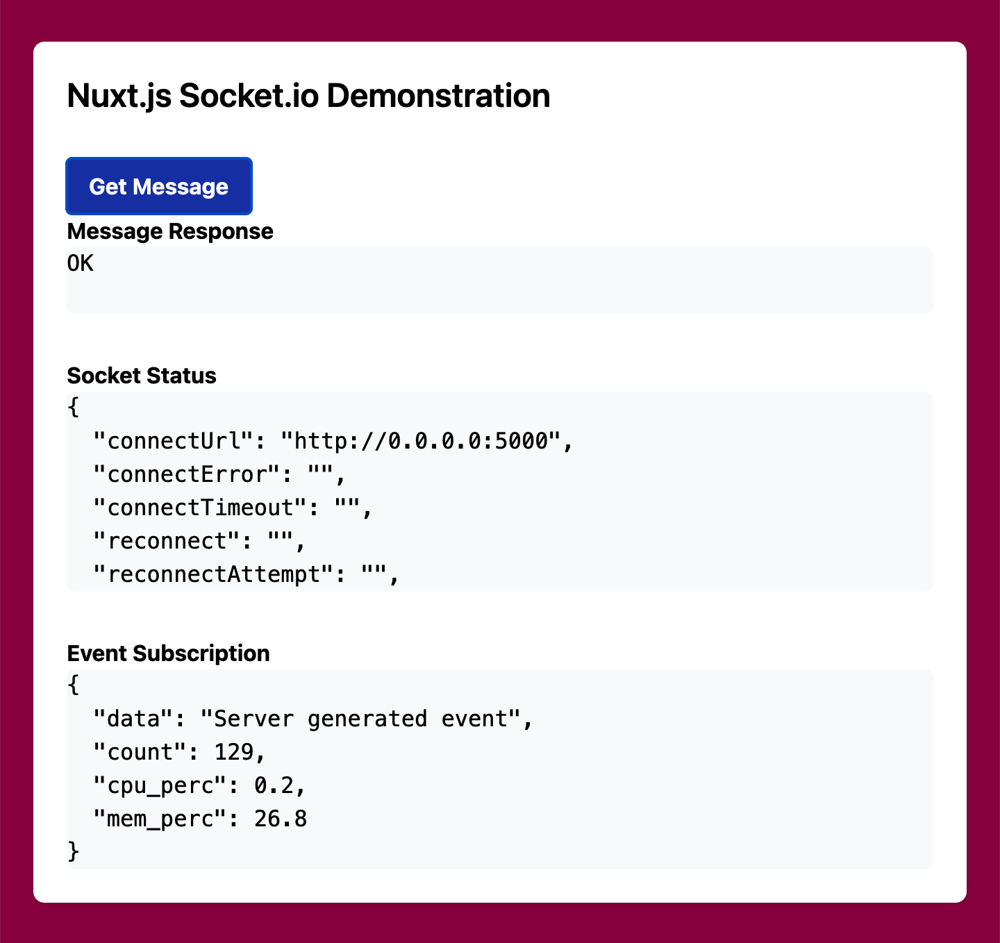

# Nuxt.js Socket.io Scaffolding

Simple scaffolding for a streaming application using Nuxt.js and Socket.io with
basic styling via Tailwind CSS. The application demonstrates the ability to
monitor socket status, `emit` an event from the client to retrieve a message,
and subscribe to long-running background tasks to determine back-end CPU and
memory utilization.

## References

### `nuxt-socket-io`

- https://github.com/richardeschloss/nuxt-socket-io
- https://nuxt-socket-io.netlify.app/

### Tailwind CSS

- https://tailwindcss.com

### `python-socketio`

- https://github.com/miguelgrinberg/python-socketio
- https://python-socketio.readthedocs.io/en/latest/index.html
